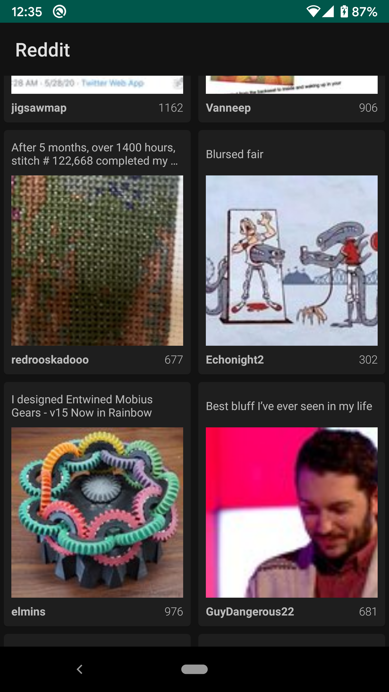
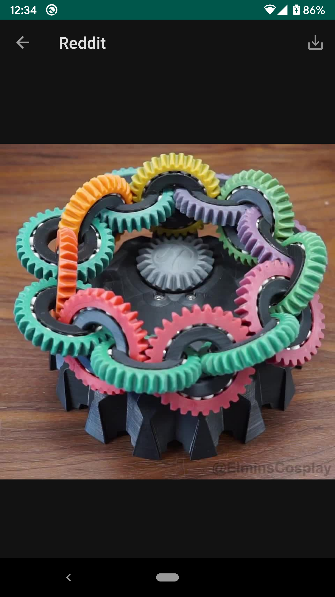

# Simple Reddit client

Top news|News details
:-:|:-:
|

## Features
* Load top news from Reddit
* Pagination
* Rotation support
* Show full image in Details Screen
* Play gif animation in thumbnails

### WIP
* Download image

### TODO
* Save image to the gallery
* Room
* Navigation library
* Pagination library
* Add Card view transition
* Play gif animation on details
* Image placeholder
* Modularization

## Technologies, Components
* Kotlin
* MVVM
* Android architecture components
    * ViewModel
    * LiveData
* DataBinding / ViewBinding
* Koin 2
* Coroutines
* Retrofit
* MaterialCardView

### In `dagger` branch
* Android Dagger 2
* Rxjava 2