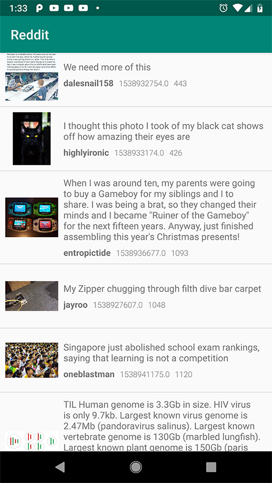

# Simple Reddit client

## Features
* Load top news from Reddit
* Show full image
* Rotation support

## TODO
- [ ] Pagination
- [ ] Save image to the gallery

## Technologies, Components
* Kotlin
* MVVM
* Android architecture components
    * ViewModel
    * LiveData
* DataBinding
* Android Dagger 2
* Rxjava 2
* Retrofit